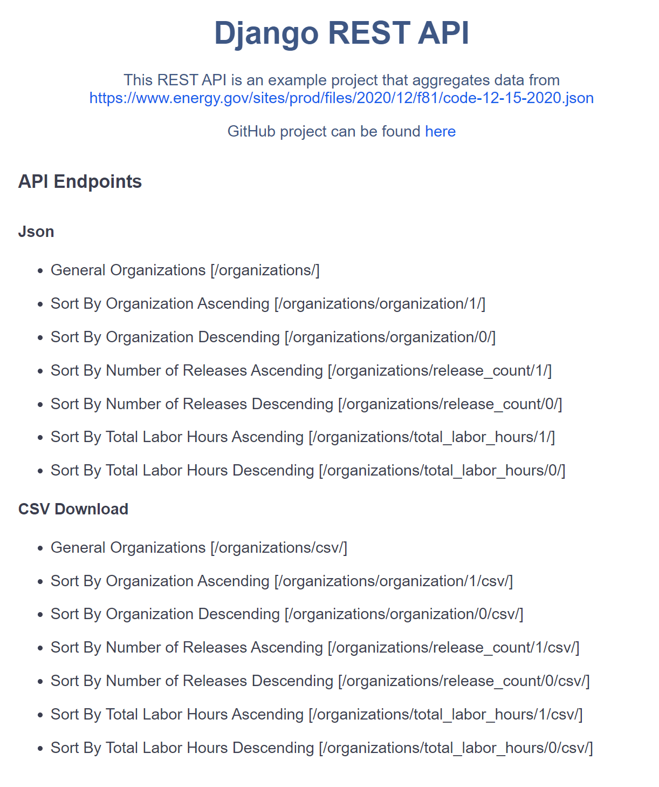

# Developer Tools REST API

### View live API by [clicking here!](https://still-lake-53461.herokuapp.com/)

Pull the Docker image with:
```
docker pull codedogmcgee/developer_tools_django_rest_api
```

## API Endpoints
General endpoint:
```
organizations/
```
To sort by column and direction use _organizations/str:sort_column/int:ascending/_, where acceptable values for
ascending are 1 for True, or 0 for False. Acceptable sort_columns are _organization, release_count, or total_labor_hours_. For example:
```
organizations/total_labor_hours/0/
```
will return data sorted by total_labor_hours in descending order.

Additionally, tag 'csv/ to the end of any existing endpoint for a downloadable CSV file.
```
organizations/total_labor_hours/0/csv/
```
The above endpoint will automatically download an organizations.csv file sorted by total_labor_hours in descending order.

## Homepage
Visit the homepage for clickable links to various endpoints.


## Build the Project
Clone the project from [GitHub](https://github.com/codeDogMcGee/DeveloperToolsRestApi).

__In Windows__

Create a Python virtual environment, activate the environment, and install the dependencies from _requirements.txt_. Make sure Python is installed and in your main path and you are in the project directory, then in your command line:
```
python -m venv venv
venv\Scripts\activate.bat
(venv) pip install -r requirements.txt
```
The only difference when using Linux is instead of _{venv\Scripts\activate.bat}_ you would _{source venv/Scripts/activate}_ to activate the Python environment.

To run the server cd into the Django project and in your command line:
```
(venv) cd developer_tools
(venv) python manage.py runserver
```
Once the server is running navigate to [localhost:8000](http://127.0.0.1:8000/) to find the clickable endpoints.